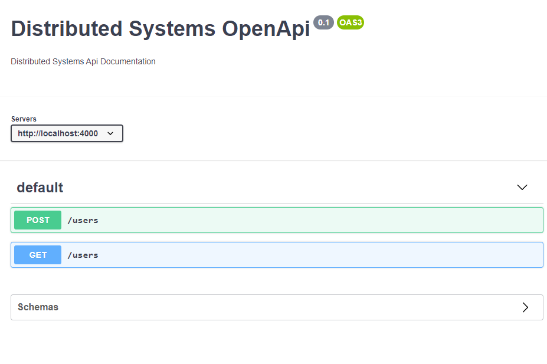
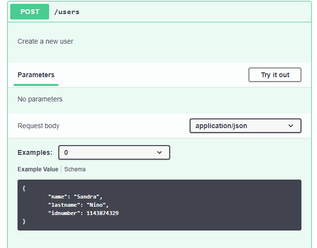
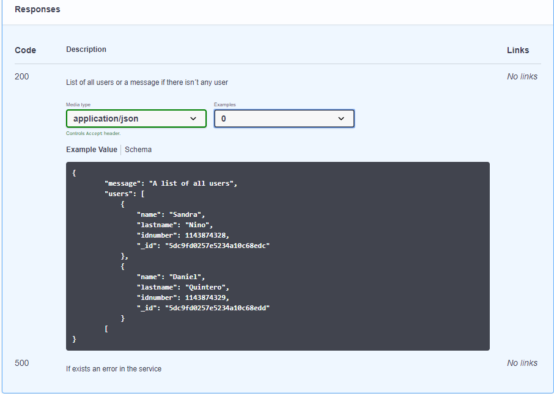
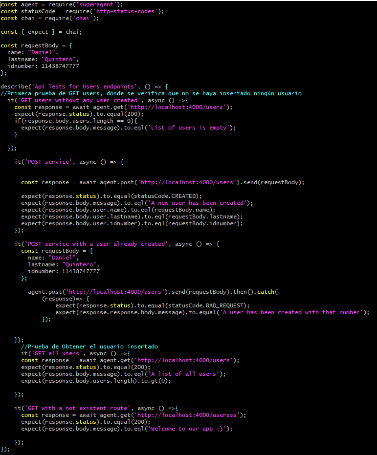
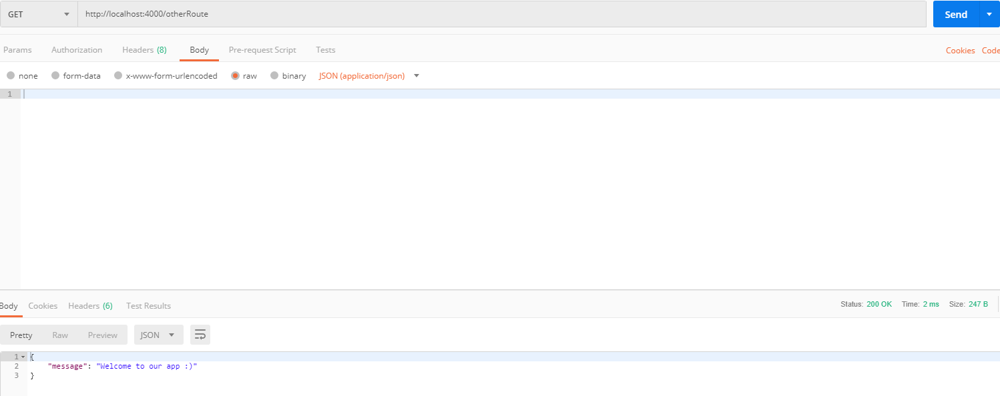

# Segundo parcial de Sistemas Distribuidos 2019-2

## Integrantes
- Sandra Mishale Niño Arbeláez- A00022220
- Daniel Quintero Correa - A00021588

## 1. Documentación de la API de conformidad con el éstandar OpenAPI
OpenAPI, originalmente conocida como Swagger Specification, es una especificación para describir, producir, consumir y visualizar servicios web RESTful. 

La documentación de la API puede visualizarse en el siguiente enlace:

- [Link de OpenAPI](openapi/openapi.yaml)

Sin embargo, se adjuntarán imágenes como evidencia de la documentación:

En esta primera imagen se evidencian el puerto por el cual corren los servicios a nivel local, que en este caso es el 4000, y los dos servicios implementados, GET y POST

En esta imagen se evidencia un ejemplo del request body que se debe pasar como parametro para crear un usuario (servicio POST)

En esta imagen se muestra el esquema de usuario con sus atributos que se debe mandar en el request (servicio POST)

En esta imagen se muestra las posibles respuestas cuando se le hace petición al servicio POST

En esta imagen se muestra el servicio GET, dónde se evidencia que éste no necesita parametros para una petición

En esta imagen se muestra las posibles respuestas cuando se le hace petición al servicio GET

En esta imagen se muestran los nombres de los esquemas que se utilizan para petición de servicios y para dar respuesta a ellos

En esta imagen se evidencia con más detalle los esquemas del punto anterior y sus atributos

## 2. Pruebas unitarias
Para realizar las pruebas unitarias se instalaron las siguientes dependencias:
- superagent
- superagent-promise
- chai
- http-status-codes
- mocha

Las pruebas unitarias que se realizaron fueron las siguientes:

En orden se encuentran:
1. Probar cuando no hay ningún usuario creado. En esta se verifica que el status sea 200 y se comprueba que el array que se devuelve tiene al menos un usuario creado, y en este caso que se devuelva un mensaje evidenciando que no hay ningún usuario creado.  
2. Probar a insertar un usuario. En esta se verifica que el status que devuelva sea 201, se compara el cuerpo de la respuesta con una variable que tiene los datos de usuario (nombre, apellidos y id), también se verifica que devuelva un mensaje que dice que un nuevo usuario ha sido creado.
3. Probar a  insertar un usuario que ya esté creado. En esta se intenta insertar el usuario insertado en la prueba anterior y se verifica que el status que se devuelva sea un 400 y que se devuelva un mensaje que diga un mensaje que diga que un usuario ya ha sido creado con ese id.
4. Probar  a obtener todos los usuarios. En esta se verifica que el status de respuesta sea 200, que se devuelva un mensaje diciendo que se obtuvo una lista de todos los usuarios y se verifica que la lista tenga un tamaño mayor a 0.
5. Probar a obtener una ruta no existente. En esta se verifica que el status de respuest sea 200 y devuelva un mensaje de bienvenida a la aplicación.

Para que las pruebas funcionen es necesario ejecutar el comando: **node index.js** (para levantar el servidor de node) y luego **npm test**

La evidencia de las pruebas corriendo en la máquina local es la siguiente:

La evidencia de las pruebas pasando por TravisCI es la siguiente:

## 3. Archivos fuente
Los archivos fuente se encuentran en el repositorio. El de mayor interés será el de index.js, el cual tiene implementado los microservicios en NodeJs, y TestEndpoints.test.js, el cual tiene implementado las pruebas unitarias.

## 4. Despliegue de los microservicios en la máquina local
4.1. En primer lugar, se usó MongoDBAtlas que es la base de datos como servicio que permite implementar, utilizar y escalar una base de datos de MongoDB.

Para la configuración de MongoDBAtlas se realizó lo siguiente:
- Se creó una cuenta de MongoDBAtlas.
- Se creó un cluster
- Se creó una base de datos con el nombre dbmongo y una colección con el nombre users para realizar las consultas de inserción y listado de los documentos. 

- Se dio acceso a la base de datos donde se creó un usuario administrador y se le asignó una contraseña. 

- Se dio acceso a la red desde cualquier IP. 

- Se extrajo la línea necesaria para hacer la conexión con nuestra aplicación.

4.2. Se usó NodeJs para realizar el backend de la aplicación. Para ello, se requirió instalar las siguientes dependencias:
- body-parser
- dotenv
- express
- mongodb

A continuación, una evidencia de los microservicios implementados:

En orden se encuentran:
- **GET** /: Este endpoint hace referencia a la parte de bienvenida a la aplicación. 
- **POST** /users:  Esta parte es para crear un nuevo usuario. Lo que se realiza es verificar si no hay un usuario creado con el idnumber ingresado para poder hacer efectivamente el registro del nuevo usuario. 
- **GET** /users: Esta parte es para listar los usuarios que están ingresados en la base de datos. Sin embargo, si no hay usuarios registrados, no se listará ninguno y se devolverá un mensaje advirtiendo dicha situación. 
- **GET** *: 
Cualquier GET que se le haga a una ruta que no exista va a devolver un 200 y va a redirigir a la página principal.
- Configuración del Mongo Client para conectarse al servidor de MongoDBAtlas, donde se tiene configurado el cluster creado previamente y explicado en la sección 4.1,de esta manera se podrán realizar las consultas respectivas a la base de datos y a la colección creada previamente.

Evidencias de los microservicios funcionando:

Se realiza el GET a /:

Se realiza el POST /users para crear un nuevo user:

Se comprueba que efectivamente se creó dicho usuario en la base de datos (MongoDBAtlas):

Se trata de realizar el POST /users con el mismo idnumber del punto anterior:

Se evidencia que se pueden listar los usuarios con GET /users

Previamente agregamos un nuevo usuario y podemos ver que lista todos los usuarios agregados. 

Se comprueba que cuando hacemos GET a otra ruta, se devuelve un mensaje de bienvenida a la app

Se comprueba que cuando no hay usuarios agregados y se pide la lista, se devuelve un mensaje indicando que la lista está vacía

Para que estos microservicios funcionen es necesario ejecutar los siguientes comandos: 

 
    npm install
    node index.js

En caso de tener problemas, borrar la carpeta node_modules y ejecutar:

     npm install express
     npm install
     node index.js

## 5. Problemas encontrados y acciones efectuadas
Los problemas encontrados y las acciones efectuadas fueron las siguientes:
1. Al realizar la conexión de MongoDBAtlas con nuestra aplicación, salía el siguiente error: **Mongodb connection timeout**. El error consistía en que en la línea que nos proporcionaban había una parte así < password > y estábamos sólo sustituyendo la palabra password por nuestra contraseña del administrador. La solución fue efectivamente quitar los <> para que hiciera la conexión adecuadamente. 
2. Al correr las pruebas de manera local con el comando npm test salía el siguiente error: **echo "Error: no test specified" && exit 1 "Error: no test specified" npm ERR!** Test failed. La solución fue poner en el package.json en los scripts: **“test”: “mocha -t 5000”**.
3. Probamos a levantar los microservicios en una máquina diferente a las 2 trabajadas y persistía un error con express y node, por eso en el apartado de despliegue se deja una solución en caso de tener problemas.
4. Tuvimos varios inconvenientes con travis los cuales serán listados a continuación:
- Inicialmente Travis no estaba funcionando puesto que solo estaba corriendo el comando de las pruebas (npm test), pero para que corrieran las pruebas correctamente primero hay que levantar el servidor de node. Por tanto, en el archivo **.travis.yml** agregamos lo siguiente: 
  
    script
    
        - node index.js &
        - npm test
    El primer comando es para levantar el servidor y el & al final es para que no afecte la ejecución del siguiente comando, es decir, que corre en background. Luego al ya tener el servidor funcionando, se pueden correr las pruebas. 

- No realizaba la conexión de nuestro Mongo Client, puesto que como estabamos utilizando variables de entorno, no estábamos subiendo el archivo .env (contiene las variables de entorno) al repositorio y al subirlo ya realizó la conexión. 
- Aunque la solución del primer inciso funcionaba correctamente, nos sucedió que el Travis funcionaba intermitentemente, es decir, a veces las pruebas salían bien, otras veces no y sin haber cambiado nada del código. Esto se debía a que no alcanzaba a hacer la conexión a MongoDBAtlas correctamente y empezaba a ejecutar las pruebas inmediatamente de haberse terminado de correr el comando node index.js &. Entonces lo que realizamos fue agregar lo siguiente: 

    script
    
        - node index.js &
        - sleep 15
        - npm test
    La nueva línea agregada permitía que “se durmiera” por 15ms dándole una espera para que se conectará correctamente a MongoDBAtlas y luego sí ejecutará las pruebas para que salieran exitosas :)

## Bibliografía

OpenApi: https://en.wikipedia.org/wiki/OpenAPI_Specification

MongoDBAtlas: https://www.mongodb.com/presentations/mongodb-atlas-la-mejor-forma-de-utilizar-mongodb-en-la-nube-1
